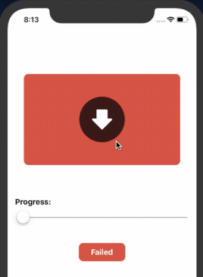

# BTProgressView

[](https://github.com/Carthage/Carthage)
[](http://cocoapods.org/pods/DialogBox)
[](http://cocoapods.org/pods/DialogBox)

This framework helps you to build beautiful string based progress animation in just few lines of code and easy theme customization.

## Example



```swift
let progressView = BTProgressView()
// set autolayout constraints
view.addSubview(progressView)
progressView.load()
```

Following are the customization options:


```swift
progressView.barColor
progressView.progressColor
progressView.iconColor
progressView.iconBgColor
progressView.doneTitleColor
progressView.failedTitleColor
```

### Carthage

[Carthage](https://github.com/Carthage/Carthage) is a decentralized dependency manager that builds your dependencies and provides you with binary frameworks. A minimum version of `0.17` is required.

To install, simply add the following lines to your Cartfile:

```ruby
github "dhawaldawar/BTProgressView" ~> 1.0.0
```

## Author

Dhawal Dawar, dawar.dhawal@gmail.com

## License

BTProgressView is available under the MIT license. See the LICENSE file for more info.
